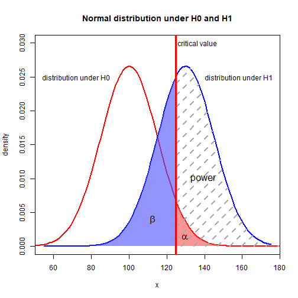

Type-II Error Calculator
========================================================
author: Daniel Baquero
date: 2020 - May - 30
autosize: true

What is this APP?
========================================================

The App is a simple Type-II error calculator for the two-sided know variance case.
This is pretty simple. The app calculates the probability of not rejecting H_0 in the
case it is false. This can be seen in next page plot.  
Type-II error is the blue area.  
Type-II error is also know as beta.

Type-II Error Example
========================================================



How It Works
========================================================

This works by calculating the probability of seeing a x_bar under the real populations distribution.  
For example,  
- Imagine an observed x_bar = 4 with n = 10.  
- Also, the population real variance is known. Sigma^2 = 0.5.  
- Additionally, we know that the population real mean is 3.  
- The test was done with an alpha = 0.05.  
- What is type-II error?

Example Result
========================================================


```r
        #First calculate the mean standard error
        n <- 10
        sigma <- sqrt(0.5)
        std_e <- sigma/sqrt(n)
        
        #Calculate bounds for non-rejection of null hypotesis
        alpha <- 0.05
        mu0 <- 4
        mu <- 3
        I <- c(alpha/2, 1 - alpha/2)
        q <- qnorm(I, mean = mu0, sd = std_e)
        
        #Calculate probabilities of type two error
        b1 <- pnorm(q[1], mu, sigma)
        b2 <- pnorm(q[2], mu, sigma)
        b <- b2 - b1
        b
```

```
[1] 0.1925005
```
